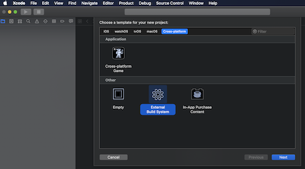
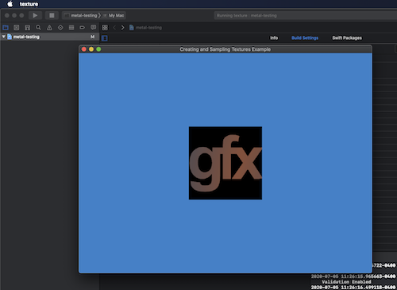

# Debugging in Xcode

Let's walk through an example of debugging the [`texture` example](/examples/texture).

<em style='display: block'>
Create a new project using the "External Build System" template.
</em>

<em style='display: block'>
Set the build command to be `cargo` and set the working directory to be the `metal-rs` repository.
Set the arguments to `build --example texture`
</em>

Click `build` once in order to generate the executable.

> If you get any shader compilation errors edit your `Build Settings` with `LIBCLANG_PATH=/usr/local/opt/llvm/lib` after running `brew install llvm`.

<em style='display: block'>
`Product > Scheme > Edit Scheme` and choose the `metal-rs/target/texture` executable.
</em>

<em style='display: block'>
Now when you click `run` you should see the textured quad example in a window.
</em>

<em style='display: block'>
From here you'll be able to use XCode's Metal debugging tools on your running application, such as capturing a GPU frame.
</em>

See [Developing and debugging shaders](https://developer.apple.com/documentation/metal/shader_authoring/developing_and_debugging_metal_shaders) for more infromation on
debugging Metal applications in XCode.
