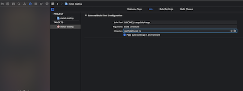

# Debugging in Xcode

If you only want to enable Metal validation without using Xcode, use the `METAL_DEVICE_WRAPPER_TYPE=1` environment variable when lauching your program. For example, to run the `window` example with Metal validation, use the command `METAL_DEVICE_WRAPPER_TYPE=1 cargo run --example window`.

Let's walk through an example of debugging the [`texture` example](/examples/texture).

---

Create a new project using the "External Build System" template.

---

Set the build command to be `cargo` and set the working directory to be the `metal-rs` repository.

Set the arguments to `build --package texture`

---

Click `build` once in order to generate the executable.

> If you get any shader compilation errors edit your `Build Settings` with `LIBCLANG_PATH=/usr/local/opt/llvm/lib` after running `brew install llvm`.

`Product > Scheme > Edit Scheme` and choose the `metal-rs/target/texture` executable.

---

Now when you click `run` you should see the textured quad example in a window.

---

From here you'll be able to use XCode's Metal debugging tools on your running application, such as capturing a GPU frame.

---

See [Developing and debugging shaders](https://developer.apple.com/documentation/metal/shader_authoring/developing_and_debugging_metal_shaders) for more infromation on
debugging Metal applications in XCode.

# Capture GPU Command Data to a File

You can also [capture GPU command data programatically](https://developer.apple.com/documentation/metal/frame_capture_debugging_tools/capturing_gpu_command_data_programmatically). 

Note that Xcode has a closed source approach to how it sets the `GT_HOST_URL_MTL` environment variable that is required for captures, so you must run your application within Xcode in order to use the frame capture debugging tools.
